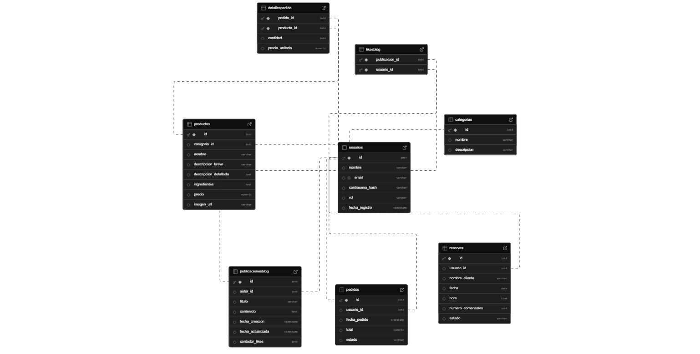

# 🍣 APP-RESTAURANTE DE SUSHI  

**Proyecto:** Aplicación Web para el Restaurante **"Qitchen"**

Este repositorio contiene el desarrollo de una aplicación web para un restaurante de sushi.  
El proyecto implementa una **SPA (Single Page Application)** usando **Vanilla JavaScript** y **Web Components** en el **frontend**, y una **API RESTful** con **Node.js**, **Express** y **Prisma ORM** en el **backend**, conectada a una base de datos en **Supabase (PostgreSQL)**.

---

## 📁 Estructura del Proyecto

```
├── backend/
│   ├── prisma/               # Esquema de base de datos
│   ├── controllers/          # Lógica de negocio (MVC)
│   ├── middleware/           # Autenticación con JWT
│   ├── routes/               # Endpoints REST
│   ├── .env                  # Variables de entorno
│   ├── db.js                 # Cliente Prisma
│   ├── server.js             # Servidor Express
│   └── package.json          # Dependencias
│
├── frontend/
│   ├── components/           # Web Components
│   ├── blocks/               # Estilos con BEM
│   ├── services/             # Carrito y autenticación
│   ├── assets/               # Iconos e imágenes
│   ├── css/                  # Estilos globales
│   ├── index.html            # Entrada SPA
│   ├── router.js             # SPA Routing
│   └── schema_design/        # Esquema de base de datos (imagen)
│
└── .gitignore
```

---

## 🗄️ Base de Datos

> Este proyecto utiliza **PostgreSQL**, gestionado desde **Supabase**, y sincronizado con **Prisma ORM**.

📌 **Conexión**:

```env
DATABASE_URL="postgresql://postgres:@db.widyfbkhpyvdoceqwetg.supabase.co:5432/postgres"
JWT_SECRET="tu_clave_secreta_aqui"
```

📷 **Esquema visual**:  


---

## 🧱 Patrones de Diseño Utilizados

### 🔁 Observer Pattern (Frontend)

Permite reaccionar a cambios de estado como el inicio de sesión o el contenido del carrito.

```js
// auth-service.js (Sujeto)
notificar() {
  this.observadores.forEach(obs => obs.update(this));
}

// site-header.js (Observador)
update(servicio) {
  if (servicio.estaLogueado()) this.render();
}
```

### 🧠 MVC + Middleware (Backend)

- Controladores (controllers/) para manejar lógica de negocio.
- Middleware con **JWT** para autenticación segura de usuarios.

---

## 🧰 Tecnologías Utilizadas

### 🔙 Backend

- Node.js  
- Express  
- PostgreSQL (via Supabase)  
- Prisma ORM  
- JWT (jsonwebtoken)  
- Bcrypt.js  

### 🎨 Frontend

- HTML5  
- CSS3 (con BEM)  
- Vanilla JavaScript  
- Web Components  

### 🛠️ Herramientas

- Git  
- npm  
- Supabase  
- Prisma Studio  

---

## 🚀 Instalación y Ejecución

### 🔧 Clonar el proyecto

```bash
git clone <URL-del-repositorio>
cd PROYECT_RESTAURANTE
```

### 🔧 Backend

```bash
cd backend
npm install
```

Crear archivo `.env` en `/backend`:

```env
DATABASE_URL="postgresql://postgres:@db.widyfbkhpyvdoceqwetg.supabase.co:5432/postgres"
JWT_SECRET="tu_clave_secreta_aqui"
```

### ▶️ Ejecutar el proyecto

- **Terminal 1: Backend**

```bash
cd backend
npm run dev
```

- **Terminal 2: Frontend**

```bash
cd frontend
npm run dev
```

---

## 📡 Endpoints Principales

| Método | Endpoint                   | Descripción                                  |
|--------|----------------------------|----------------------------------------------|
| POST   | `/api/usuarios/registro`   | Registro de un nuevo usuario                 |
| POST   | `/api/usuarios/login`      | Login de usuario y retorno de JWT            |
| GET    | `/api/productos`           | Obtiene productos por categoría              |
| POST   | `/api/pedidos`             | Crea un nuevo pedido (requiere autenticación)|

---

## 🖌️ Diseño de la UI (Figma)

[Figma – UI del Proyecto](https://www.figma.com/design/VkCxnTC1OaLEefSAEGOS8r/Restautant-Sushi?node-id=3220-239&t=cjRYKhr009JDya05-1)

---

## 📝 Documento de Defensa

📄 [Documento de defensa – Google Docs](https://docs.google.com/document/d/1ZXYeKWiLN4GmGn6GCSbg0iXaw74pHoB5jokzgdGC-88/edit?usp=sharing)
